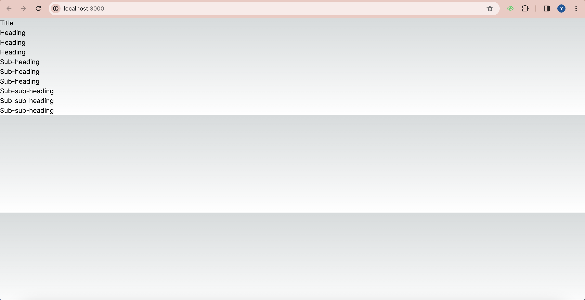

|  | Pemrograman Berbasis Framework 2024 |
|--|--|
| NIM |  2141720135 |
| Nama |  Mutiara Devita Eka Putri |
| Kelas | TI - 3A |

1. Capture hasilnya dan buatlah laporan di README.md. Jelaskan apa yang telah Anda pelajari dan bagaimana tampilannya saat ini?
Jawab :
Pada langkah ini kita mempelajari cara menggunakan context dengan diakses oleh komponen child didalamnya. Context memungkinkan sebuah komponen induk menyediakan data untuk seluruh pohon (tree) dibawahnya. Ada banyak kegunaan dari context.
